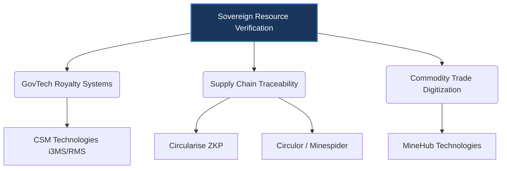

# Competitor Analysis & Strategic Moat

This document outlines the competitive landscape for **Resource Command**, comparing our ZK-based sovereign royalty verification platform against existing GovTech royalty management systems, B2B supply chain traceability networks, and digital trade platforms.

---

## 1. The "Sovereign Trust" Moat

Most blockchain and supply chain platforms suffer from a fundamental vulnerability: **"Garbage In, Garbage Out" (GIGO)**. They trust operator self-reporting, manual ERP uploads, and easily-tampered physical weighbridges. 

Resource Command shifts the trust model from human validation to **mathematical and physical certainty**. Our technical moat is built on four pillars:
1. **Independent Spatial Intelligence (LiDAR/Satellite):** We verify physical extraction volumes at the mine-face from above, bypassing operator self-reporting and validating coordinates.
2. **Zero-Knowledge Royalty Proofs (ZKP):** We prove tax/royalty math dynamically in ZK circuits, preventing database discrepancy friction with tax authorities like the ZRA.
3. **Edge Cryptography (Keystone TEEs):** We secure proof generation at the mine-face, ensuring raw operational data cannot be edited by the mine operator.
4. **Tamper-Proof Transit IoT:** We secure the logistical corridor (pit-to-smelter/port) with cryptographically bound, tamper-proof IoT tracking devices, preventing roadside cargo diversion or mineral swapping.

---

## 2. Competitive Segments

### Segment A: GovTech & Centralized Royalty Management Systems (RMS)
*   **Primary Competitor:** **CSM Technologies** (Odisha i3MS, Kenya RMS).
*   **Focus:** Digitizing the state mining registry, automating compliance checks, and integrating physical weighbridges.
*   **Limitations:** Centralized relational databases that are highly vulnerable to database manipulation, local check-gate corruption, physical weighbridge miscalibration, and spoofed GPS trackers.

### Segment B: B2B Supply Chain Traceability & ESG Compliance
*   **Primary Competitors:** **Circularise**, **Circulor**, **Minespider**, **Everledger**.
*   **Focus:** Tracking mineral provenance (e.g., cobalt, lithium) from mine to automotive OEM to meet EU Battery Regulations and ESG mandates.
*   **Limitations:** Purely B2B supply-chain facing. They target downstream brands (Volvo, BMW) rather than sovereign governments. Furthermore, most (excluding Circularise) rely on simple blockchain ledgers with no ZK privacy features, forcing companies to expose trade secrets or upload unverified paper trails.

### Segment C: Commodity Trade & Logistics Digitization
*   **Primary Competitor:** **MineHub Technologies**.
*   **Focus:** Digitizing invoicing, trade finance, and bill-of-lading workflows for miners, banks, and traders.
*   **Limitations:** Focuses on corporate trade logistics and transactional volume fees, completely ignoring government royalty compliance, sovereign tax leakage, and mine-face extraction verification.

---

## 3. Comparative Feature Matrix

| Feature | Resource Command (Us) | CSM Technologies (i3MS) | Circularise | Circulor / Minespider | MineHub |
| :--- | :--- | :--- | :--- | :--- | :--- |
| **Primary Customer** | Sovereign Governments (ZRA, MoF) | GovTech / State Mines Depts | Downstream OEMs (Automotive) | Downstream OEMs / Miners | Miners, Banks, Traders |
| **Verification Source** | Spatial (Sat/LiDAR) + Transit (IoT) | Physical Weighbridges & GPS | Operator Self-Reporting | Operator Self-Reporting | Commercial Invoices & ERP |
| **Privacy Model** | Zero-Knowledge Proofs (ZKP) | Centralized DB (No Privacy) | ZKP (Smart Questioning) | Public/Private Blockchain | Permissioned Ledger |
| **Tamper Resistance** | Hardware TEE + ZK + Tamper-Proof IoT | Standard IT databases | Software-only Node | Software-only Node | Software-only SaaS |
| **Key Use Case** | Sovereign Royalty Leakage & Debt Collateral | Transit Permits & Weighing | EU Battery Passports | Supply Chain Provenance | Trade Finance Digitization |

---

## 4. Deep Dive: CSM Technologies (i3MS & Kenya RMS)

CSM Technologies is the dominant GovTech player in resource tracking across India (Odisha, Jharkhand) and is actively expanding into Africa (recently securing a contract to implement a **Royalty Management System (RMS)** in Kenya).

> [!WARNING]
> **Their Vulnerability is Our Opportunity:**
> CSM's i3MS relies on integrating existing hardware (weighbridges, GPS transponders, RFID check-gates) into a centralized state database. 
> *   **Local Tampering:** Miners regularly bypass GPS tracking by turning off transponders or claiming signal loss. Weighbridges can be mechanically calibrated to under-report weight. CSM has no way to detect if ore was swapped during transport.
> *   **Systemic Corruption:** Centralized databases are managed by local administrators. If a database record is modified manually, the audit trail is easily wiped or falsified.
> *   **No Spatial Validation:** They have no capacity to detect whether copper or gold is being extracted *outside* the concession boundaries via satellite/radar change detection.
> 
> **How our Tamper-Proof IoT wins:** Instead of basic consumer-grade GPS trackers that can be unplugged or shielded, Resource Command deploys cryptographically bound IoT transit trackers. If a truck goes off-route, stops for an unauthorized period (indicating potential cargo diversion/swapping), or the device is tampered with, the cryptographic signature is invalidated, and the ZK proof generation fails.

**Resource Command's counter-strategy:** We position our platform not as an ERP replacement, but as a **cryptographic trust anchor**. We tell governments: *"Keep your weighbridges and ERPs, but use our ZK satellite proofs to audit them automatically. If the satellite elevation model shows 10,000 tons of copper ore extracted, but the weighbridge database only records 6,000 tons, the system automatically flags the discrepancy in ZK."*

---

## 5. Deep Dive: Circularise ("Smart Questioning" ZKP)

Circularise is the closest competitor on the cryptography side. They use ZKPs to let suppliers prove claims about materials without revealing their proprietary chemical recipes or supply chain structures.

> [!NOTE]
> **The B2B vs. Sovereign Split:**
> Circularise operates downstream. A manufacturer asks a supplier: *"Does this copper contain conflict-free material?"* The supplier uses Circularise's ZKP to respond *"Yes"* without revealing the name of the mine.
> *   **We start at the mine-face:** We secure the royalty payment to the sovereign government before the copper even enters the global supply chain.
> *   **Dual-Use Value:** By proving the volume and origin cryptographically at the mine-face, our ZK proof receipts double as the perfect foundational data for the **EU Battery Passport** when that copper is exported. We solve the sovereign royalty problem *and* the export compliance problem simultaneously.

---

## 6. How We Win in Zambia

We win by aligning directly with Zambia's macroeconomic and sovereign interests, whereas competitors offer pure software tooling:

1. **IMF & World Bank Alignment:** Zambia needs to show international creditors verifiable, non-manipulable revenue streams to restructure sovereign debt. CSM's weighbridges do not lower Zambia's sovereign risk profile. A mathematically audited ZK royalty registry does.
2. **Pre-election Commitment:** By securing the Bank of Zambia Sandbox Phase 2 and ZRA Letter of Intent prior to the **1 August 2026** election, we bake our math directly into the state compliance architecture, making the platform politically resilient.
3. **Zero Operator Friction:** We do not force mines to change their internal software or compromise their proprietary trade secrets. The ZK circuit runs on TEEs, generating proofs of compliance without exposing the mine's internal commercial spreadsheets.
